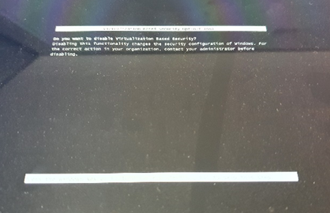
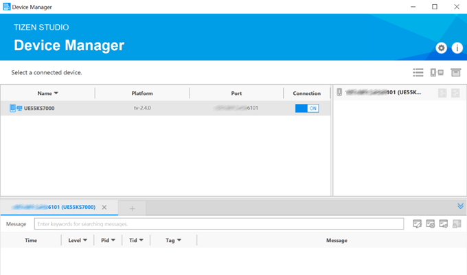

# Samsung Bing Desktop Image
Show the Bing Image of the day on the Samsung Smart TV using .NET

# Developer setup
You have a couple of options to setup the tizen development environment.  Option 2 is recommended.

## Option 1 - Tizen Studio for Visual Studio
Download and install Tizen Studio from here: https://docs.tizen.org/application/vstools/install/.  This can take a few hours.  

## Option 2 - Devcontainers
This project uses devcontainers to simplify the development effort required to setup a Tizen NET developer environment.  Therefore, open this project in VSCode and press F1, then `Remote-Containers: Open Folder in Container...`

Once inside the running you can run the tizen developer tools.

### GUI Utilities on Windows
Some of the tizen developer tools have a GUI to help setup and manage devices.  You can use the Xming tool to run this from within the running container.

First get your IP address
Add your IP address to the Xming host file within: C:\Program Files (x86)\Xming\X0.hosts
Add you IP address to the devcontainer.json file within the `containerEnv` block eg:

```json
"containerEnv": {
    "DISPLAY": "192.168.1.30:0"
}
```

Start the Xming utility on your Windows host machine, then run the tizen developer tool eg:

```bash
cd ~
cd tizen-studio/tools/device-manager/
./device-manager
```

# Deploying to the device emulator

Running the application on an emulator before deploying to your TV is the preferred development cycle.  However, this can take some patience to setup as the Tizen emulator uses Intel HMAX technology, which is incompatible with Hyper-V.  So you'll have to completely uninstall and remove Hyper-V.  However, even after removing Hyper-V and rebooting the Tizen emulator is still likely to complain if your machine is running Device Guard.  The Device Guard and Credential Guard readiness tool can disable this:

- Download from here and unzip: https://www.microsoft.com/en-us/download/details.aspx?id=53337
- Open an elevated Command Prompt
- Powershell.exe -ExecutionPolicy RemoteSigned -Command "X:\path\to\dgreadiness_v3.6\DG_Readiness_Tool_v3.6.ps1 -Disable"
- Reboot
- On rebooting you'll be prompted to accept this:



For additional troubleshooting see this: https://github.com/intel/haxm/blob/master/docs/manual-windows.md#disabling-hyper-v-on-windows-10


# Deploying to a real device

Enable developer mode on your physical TV: https://developer.samsung.com/smarttv/develop/getting-started/using-sdk/tv-device.html#connecting-the-tv-and-sdk

Get the IP of your TV (from your router), then add to the Device Manager utility eg:



# Troubleshooting

There is a fair amount that can go wrong with Tizen deployment, from development environment setup and dependencies to the physical hardware compatibility.  Here are a few things to help you check:

- Check your TV is compatible: https://developer.samsung.com/smarttv/develop/specifications/tv-model-groups.html
- Download your TV's relevant TV Extension: https://developer.samsung.com/smarttv/develop/tools/tv-extension/archive.html

